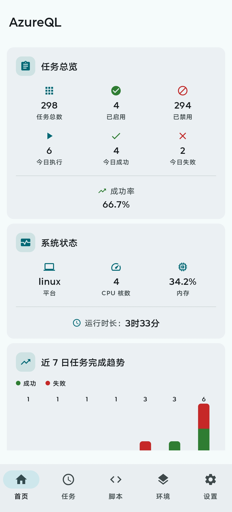
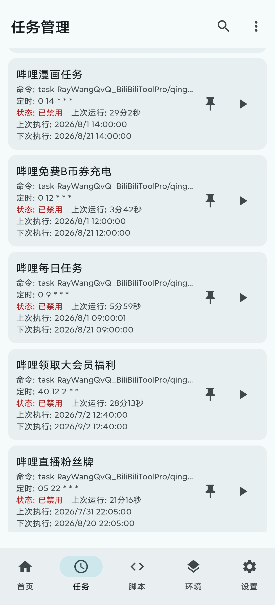
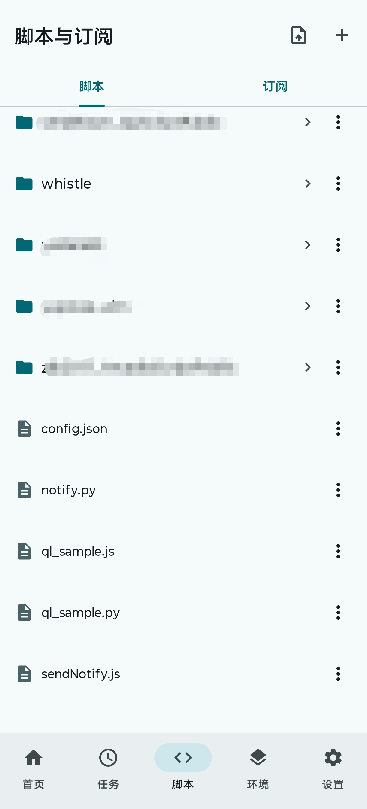
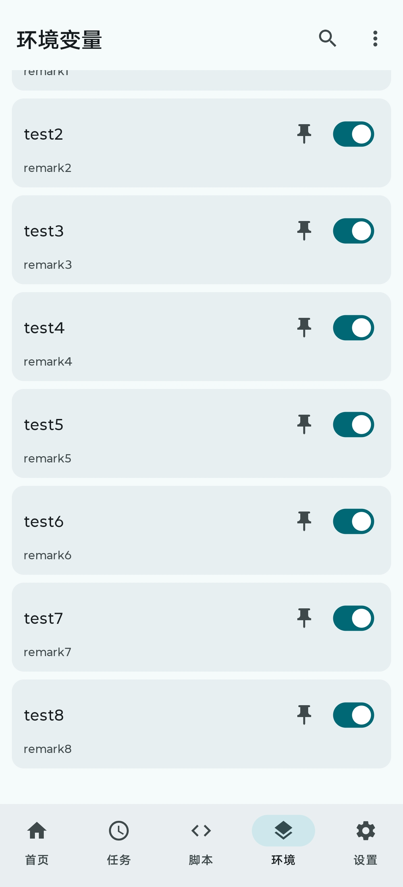
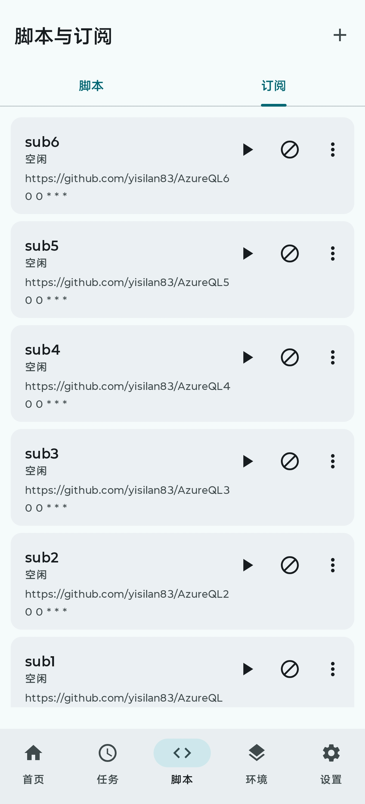
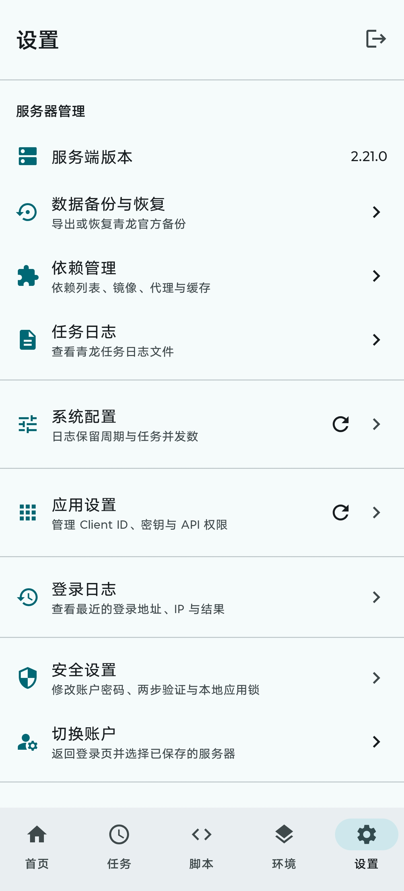

<p align="center">
  
</p>

<h1 align="center">AzureQL</h1>

<p align="center"><strong>Azure Dragon Panel</strong></p>

<p align="center">面向青龙服务端的原生 Android 管理客户端</p>

[](https://kotlinlang.org)
[](https://developer.android.com/compose)
[](https://dagger.dev/hilt/)
[](https://square.github.io/retrofit/)
[](LICENSE)

AzureQL 是基于 [青龙面板 API](https://github.com/whyour/qinglong) 的原生 Android 客户端，对外名称为 **Azure Dragon Panel**，使用 **Kotlin + Jetpack Compose + Material 3** 构建。

> **兼容性**：青龙 v2.17+ 后端已从 MongoDB 迁移至 SQLite，本应用已对齐数字自增主键 `id`（非旧的 MongoDB `_id` 字符串）。
>
> **系统要求**：Android 12（API 31）及以上。

## 📱 应用展示

<table>
  <tr>
    <td align="center"><strong>首页仪表盘</strong><br></td>
    <td align="center"><strong>定时任务</strong><br></td>
    <td align="center"><strong>脚本管理</strong><br></td>
  </tr>
  <tr>
    <td align="center"><strong>环境变量</strong><br></td>
    <td align="center"><strong>订阅管理</strong><br></td>
    <td align="center"><strong>设置</strong><br></td>
  </tr>
</table>

## ✨ 特性

- 🎨 **Material You** 动态配色（Light / Dark 主题）
- 🔐 **两步验证 (2FA)** — 同时提供二维码、手动密钥和验证码确认
- 🔑 **mTLS 客户端证书** 支持（`.p12` / `.pfx`；服务端证书须受系统信任）
- 🔏 **Bitwarden 自动填充**（用户名 / 密码 / 两步验证码语义标记）
- 🏗️ **Clean Architecture** + MVVM 架构
- 💉 **Hilt** 依赖注入
- 🌐 **Retrofit** 网络层（系统证书校验 + 客户端证书）
- 🔐 **每账户加密凭据** — 记住密码后按服务器、账户和登录模式分别使用 Android Keystore 加密，切换历史账户可安全回填
- ⚡ **加密本地缓存** — 首页、任务和脚本树先显示缓存再刷新，按账户隔离并自动清理 8 天前数据
- 📝 **大脚本可靠工作流** — 文件流写入账户隔离的私有缓存，服务端 `size`/可用 `mtime` 比对后复用；按段预览、上传二次确认、冲突确认与待上传草稿恢复
- 🧭 **类型安全导航** (`@Serializable` routes)
- 📊 **首页仪表盘** — 任务总览卡 + 系统状态卡（内存 / CPU / 运行时长）
- 🗂️ **功能模块** — 定时任务、环境变量、脚本、订阅、依赖与日志管理
- ⏱️ **青龙 2.21 任务管理** — 常规/手动/开机运行、附加定时、标签筛选、实例模式、日志目录与执行前后命令
- 🏷️ **标签与脚本联动** — 标签管理显示引用数，支持安全重命名与未引用标签删除；任务命令可定位并打开实际脚本
- 📥 **脚本导入** — 从 Android 系统文件选择器批量导入现有脚本
- 🔄 **订阅管理** — 支持公开/私有仓库与单文件，以及白黑名单、依赖、后缀、代理和自动任务策略
- 💾 **服务端备份** — 通过青龙官方 API 导出与恢复数据
- 🧩 **本地 MCP（Phase 2）** — 10 个限长只读工具、13 个逐次确认的受控工具、Agent 独立权限、幂等与本地脱敏审计

## 🏗️ 架构

```
app/                        ← 入口 + DI + 首页 / 配置
├── core/
│   ├── model/              ← 纯 Kotlin 领域模型
│   ├── data/               ← Repository + Retrofit + Room 加密缓存 + mTLS
│   ├── domain/             ← UseCase + Repository 接口
│   ├── mcp/                ← MCP 协议适配 + 回环 Streamable HTTP 引擎
│   └── ui/                 ← 共享 Compose 组件 + Theme
└── feature/
    ├── login/              ← 登录 + 两步验证 + mTLS 证书选择
    ├── task/               ← 定时任务管理
    ├── env/                ← 环境变量管理
    ├── script/             ← 脚本导入 / 分段预览 / 本地编辑 / 订阅管理
    ├── dependency/         ← 依赖管理
    ├── backup/             ← 服务端数据备份与恢复
    ├── log/                ← 日志查看
    ├── mcp/                ← MCP 前台服务 + 技术预览设置页
    └── settings/           ← 设置（系统配置 / 登录日志）
```

## ⚡ 性能与大脚本策略

- 首页、任务和脚本树采用“缓存先显示、服务端随后刷新”；缓存 JSON 解码和脚本树排序在
  后台调度器执行，底部主导航关闭无必要的页面切换动画，减少应用冷启动后的首次切页负担。
- 冷启动把会话和主题偏好合并成一个本地首帧快照；Android 12 系统 Splash 使用静态图标，
  不播放图标动画或退出动画，快照就绪后直接显示登录页或首页。
- 任务与订阅编辑在窄屏上使用等宽分段选择，三种主类型无需横向滚动；设置页长按服务端
  版本可用系统默认浏览器打开当前登录地址。
- 脚本下载使用青龙官方文件流接口，避免把大文件包装成一个巨大 JSON 字符串。小于等于
  512 KiB 的 UTF-8 文件可在应用内编辑；512 KiB～10 MiB 文件使用 8192 字符分段预览，
  并可交给系统文本编辑器修改；超过 10 MiB 的文件仅预览和下载。
  分段渲染会在字形安全边界拆开超长行，保持原始文本和复制内容不被视觉换行改写。
- 编辑后的文件通过 multipart 文件流上传；HTTP 成功后仍须以服务端版本大小复核。复核不
  确认、离线、超时或服务端错误时草稿保留为“待上传”，不会误报成功。回传前会比较服务端
  `mtime`、大小或原始文件哈希；发现脚本已被其他客户端修改时必须由用户确认是否覆盖。
  非法 UTF-8 文件不会被替换字符后误写回服务端。
- 大脚本草稿是为外部编辑器准备的应用私有临时明文文件，不写入 Room 响应缓存、不参与
  备份，也不包含 Token。干净关闭保留缓存供版本比对复用，显式放弃修改或确认上传后删除；
  维护任务会清理 8 天前和 LRU 超额的草稿。外部编辑器须支持写回 Android `content://` URI。
- 2026-09-04 实测缓存复用：50 MiB 脚本首开下载约 `28.7 s`，关闭后重开约 `2.6 s`，
  约为 `11x` 提升；内容文件 mtime 保持不变，确认未重新下载。
- 当前构建 Macrobenchmark：10 MiB 长单行分页预览 CPU 帧耗时 P50/P90/P95/P99 为
  `2.6/11.6/17.8/24.3 ms`，P99 frame overrun 为 `16.3 ms`。相对修复前约 `175.0 ms`
  的长行布局尖峰，尾部 overrun 降低约 `90.7%`；冷启动 Baseline Profile OFF/ON 中位数
  `385.7/296.6 ms`，缩短约 `23.1%`。
- 独立 `:benchmark` 模块覆盖冷启动、主导航、500/1000 项任务、大脚本目录、1/5/20 MiB 日志、
  10/50 MiB 脚本和订阅日志轮询。实机一键预检、运行及 Trace 拉取方式见
  [benchmark/README.md](benchmark/README.md)，性能结论与待验证项见
  [IMPROVEMENT_PLAN.md](docs/IMPROVEMENT_PLAN.md)。

## 🧩 本地 MCP（Phase 2）

设置中的 **MCP 服务** 可由用户手动启动本地前台服务。先通过设备锁屏验证创建只读 Agent，
复制仅显示一次的 Token，再启动服务。Token 使用 256-bit 随机数生成，应用只保存哈希，并把
Agent 绑定到创建时的当前青龙账户。服务只监听 `http://127.0.0.1:18765/mcp`，校验 Host/Origin，
并实施请求体、并发和速率限制及本地脱敏审计。

基础只读工具为 `server_status`、`list_tasks`、`list_scripts`、`read_script`、`list_dependencies`、
`check_dependency`、`list_envs`、`list_logs`、`read_log_tail` 和 `get_task_log`。日志仅返回受限尾部；
环境变量值、青龙 Token、密码、证书和私钥不会暴露。

用户可在设备身份验证后，为单个 Agent 开启 Phase 2 的受控写入与执行权限。新增
`get_operation`、`create_script`、`update_script`、`run_task`、`stop_task`、
`install_dependency`、`reinstall_dependency`、`create_env`、`update_env`、`enable_env`、
`disable_env`、`create_task` 和 `update_task`。每次写入都先生成待确认 Operation；用户必须在
手机端再次验证并批准，Agent 再携带相同 `idempotency_key`、`operation_id` 和参数重试才会执行。
Operation 会持久化保存幂等结果，避免网络重试造成重复写入；脚本更新还必须携带
`read_script` 返回的 `expected_sha256`，冲突时不会强制覆盖。

MCP 设置页默认展示最近 3 条脱敏审计，可展开至最近 20 条或收起，并支持清除审计、修改 Agent
名称与权限和处理待确认操作。环境变量值和脚本
正文不会写入 Operation 或审计。删除、配置文件修改、局域网、任意 HTTP、任意 Shell 和青龙
凭据仍未开放。

电脑调试时先执行：

```bash
adb forward tcp:18765 tcp:18765
```

再让 MCP 客户端连接 `http://127.0.0.1:18765/mcp`，并发送
`Authorization: Bearer <Agent Token>`。架构、安全模型、工具契约、兼容矩阵和开源选型见
[AZUREQL_MCP_ARCHITECTURE.md](docs/AZUREQL_MCP_ARCHITECTURE.md)、
[AZUREQL_MCP_SECURITY.md](docs/AZUREQL_MCP_SECURITY.md)、
[AZUREQL_MCP_TOOL_SPEC.md](docs/AZUREQL_MCP_TOOL_SPEC.md)、
[MCP_COMPATIBILITY.md](docs/MCP_COMPATIBILITY.md) 与
[MCP_OPEN_SOURCE_REFERENCES.md](docs/MCP_OPEN_SOURCE_REFERENCES.md)。

## 🚀 快速开始

1. **克隆项目**
```bash
git clone https://github.com/Infinifar/AzureQL.git
```

2. **用 Android Studio 打开**（Hedgehog+ 推荐）

3. **构建 & 运行**
```bash
./gradlew :app:assembleDebug
```

## 🔑 登录流程

```
用户输入 Host + 用户名 + 密码（可选 mTLS 证书）
       │
       ▼
POST /api/user/login ───── code=200 ──→ 登录成功，获取 Token
       │
       │ code=420
       ▼
┌─────────────────────────┐
│   两步验证界面（内嵌）    │
│   扫描二维码或输入密钥     │
│   输入 6 位验证码         │
└─────────────────────────┘
       │
       ▼
PUT /api/user/two-factor/login ──→ 验证成功，获取 Token
```

### mTLS 客户端证书

若青龙面板启用了双向 TLS 认证，登录时：

1. 在登录界面点击 **「mTLS 证书」**
2. 选择 `.p12` / `.pfx` 证书文件（通过系统文件选择器）
3. 输入证书密码
4. 正常登录

证书路径使用 DataStore 持久化，证书密码使用 Android Keystore 加密，切换服务器后仍可复用。服务端 TLS
证书必须由 Android 系统信任；私有 CA 导入能力列在后续改进清单中。

## 📋 开发计划

- [x] **阶段一：项目基础设施** — 架构、DI、网络层、主题
- [x] **阶段二：数据层重构** — 数字主键 `id` 对齐 SQLite、批量操作 API
- [x] **阶段三：登录模块** — 密码 / ClientID 双模式 + 2FA + mTLS + Autofill
- [x] **阶段四：导航 & 主框架** — 底部导航 + 类型安全路由
- [x] **阶段五：功能模块** — 任务 / 环境变量 / 脚本 / 依赖 / 日志 / 设置
- [x] **阶段六：首页仪表盘** — 任务总览 + 系统状态卡
- [x] **阶段七：测试与发布验收** — Unit / Integration / UI / Macrobenchmark / 真机回归

## 📄 License

MIT License
