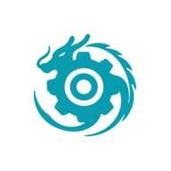
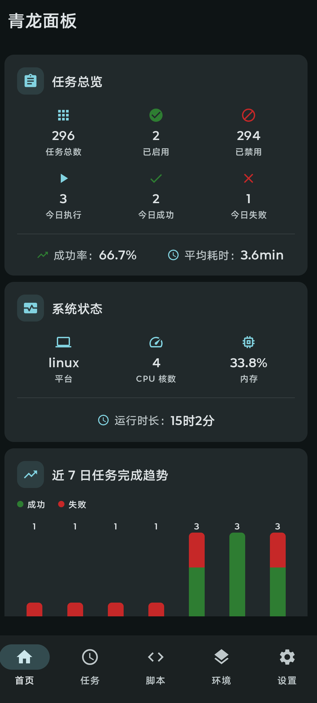
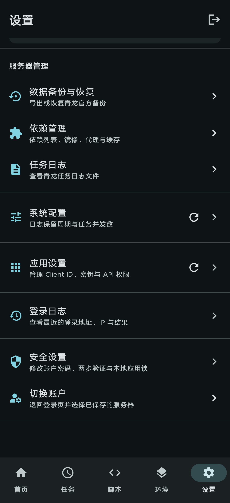

<p align="center">
  
</p>

<h1 align="center">AzureQL</h1>

<p align="center"><strong>Azure Dragon Panel</strong></p>

<p align="center">面向青龙服务端的原生 Android 管理客户端</p>

[](https://kotlinlang.org)
[](https://developer.android.com/compose)
[](https://dagger.dev/hilt/)
[](https://square.github.io/retrofit/)
[](LICENSE)

AzureQL 是基于 [青龙面板 API](https://github.com/whyour/qinglong) 的原生 Android 客户端，对外名称为 **Azure Dragon Panel**，使用 **Kotlin + Jetpack Compose + Material 3** 构建。

> **兼容性**：青龙 v2.17+ 后端已从 MongoDB 迁移至 SQLite，本应用已对齐数字自增主键 `id`（非旧的 MongoDB `_id` 字符串）。
>
> **系统要求**：Android 12（API 31）及以上。

## 📱 应用展示

<table>
  <tr>
    <td align="center"><strong>首页仪表盘</strong></td>
    <td align="center"><strong>服务器与安全设置</strong></td>
  </tr>
  <tr>
    <td></td>
    <td></td>
  </tr>
</table>

## ✨ 特性

- 🎨 **Material You** 动态配色（Light / Dark 主题）
- 🔐 **两步验证 (2FA)** — 同时提供二维码、手动密钥和验证码确认
- 🔑 **mTLS 客户端证书** 支持（`.p12` / `.pfx`；服务端证书须受系统信任）
- 🔏 **Bitwarden 自动填充**（用户名 / 密码 / 两步验证码语义标记）
- 🏗️ **Clean Architecture** + MVVM 架构
- 💉 **Hilt** 依赖注入
- 🌐 **Retrofit** 网络层（系统证书校验 + 客户端证书）
- 📦 **DataStore** 本地凭证持久化
- 🧭 **类型安全导航** (`@Serializable` routes)
- 📊 **首页仪表盘** — 任务总览卡 + 系统状态卡（内存 / CPU / 运行时长）
- 🗂️ **功能模块** — 定时任务、环境变量、脚本、订阅、依赖与日志管理
- 📥 **脚本导入** — 从 Android 系统文件选择器批量导入现有脚本
- 🔄 **订阅管理** — 在脚本模块中创建、编辑、运行、停用和删除订阅
- 💾 **服务端备份** — 通过青龙官方 API 导出与恢复数据

## 🏗️ 架构

```
app/                        ← 入口 + DI + 首页 / 配置
├── core/
│   ├── model/              ← 纯 Kotlin 领域模型
│   ├── data/               ← Repository + DataSource + Retrofit + mTLS
│   ├── domain/             ← UseCase + Repository 接口
│   └── ui/                 ← 共享 Compose 组件 + Theme
└── feature/
    ├── login/              ← 登录 + 两步验证 + mTLS 证书选择
    ├── task/               ← 定时任务管理
    ├── env/                ← 环境变量管理
    ├── script/             ← 脚本导入 / 编辑器 / 订阅管理
    ├── dependency/         ← 依赖管理
    ├── backup/             ← 服务端数据备份与恢复
    ├── log/                ← 日志查看
    └── settings/           ← 设置（系统配置 / 登录日志）
```

## 🚀 快速开始

1. **克隆项目**
```bash
git clone https://github.com/yisilan83/AzureQL.git
```

2. **用 Android Studio 打开**（Hedgehog+ 推荐）

3. **构建 & 运行**
```bash
./gradlew :app:assembleDebug
```

## 🔑 登录流程

```
用户输入 Host + 用户名 + 密码（可选 mTLS 证书）
       │
       ▼
POST /api/user/login ───── code=200 ──→ 登录成功，获取 Token
       │
       │ code=420
       ▼
┌─────────────────────────┐
│   两步验证界面（内嵌）    │
│   扫描二维码或输入密钥     │
│   输入 6 位验证码         │
└─────────────────────────┘
       │
       ▼
PUT /api/user/two-factor/login ──→ 验证成功，获取 Token
```

### mTLS 客户端证书

若青龙面板启用了双向 TLS 认证，登录时：

1. 在登录界面点击 **「mTLS 证书」**
2. 选择 `.p12` / `.pfx` 证书文件（通过系统文件选择器）
3. 输入证书密码
4. 正常登录

证书路径与密码通过 DataStore 持久化，切换服务器后仍可复用。服务端 TLS
证书必须由 Android 系统信任；私有 CA 导入能力列在后续改进清单中。

## 📋 开发计划

- [x] **阶段一：项目基础设施** — 架构、DI、网络层、主题
- [x] **阶段二：数据层重构** — 数字主键 `id` 对齐 SQLite、批量操作 API
- [x] **阶段三：登录模块** — 密码 / ClientID 双模式 + 2FA + mTLS + Autofill
- [x] **阶段四：导航 & 主框架** — 底部导航 + 类型安全路由
- [x] **阶段五：功能模块** — 任务 / 环境变量 / 脚本 / 依赖 / 日志 / 设置
- [x] **阶段六：首页仪表盘** — 任务总览 + 系统状态卡
- [ ] **阶段七：测试** — Unit / Integration / UI 测试

## 📄 License

MIT License
