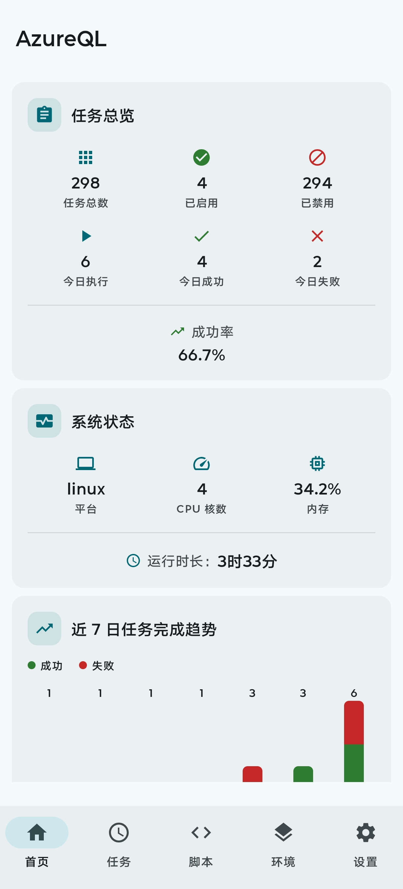
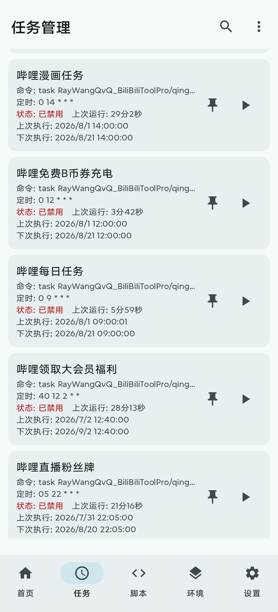
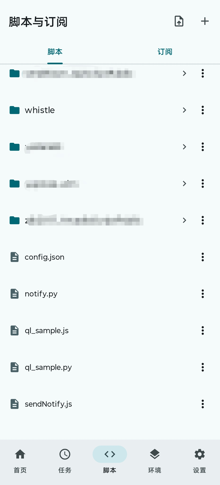
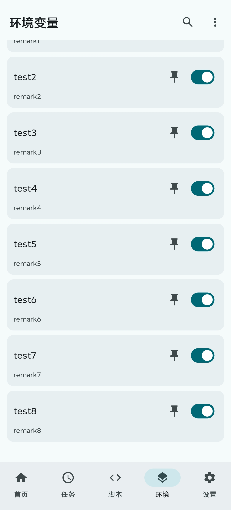
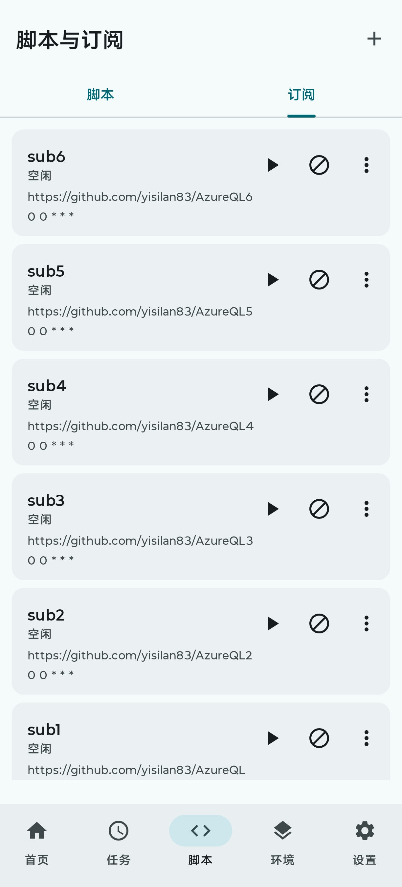
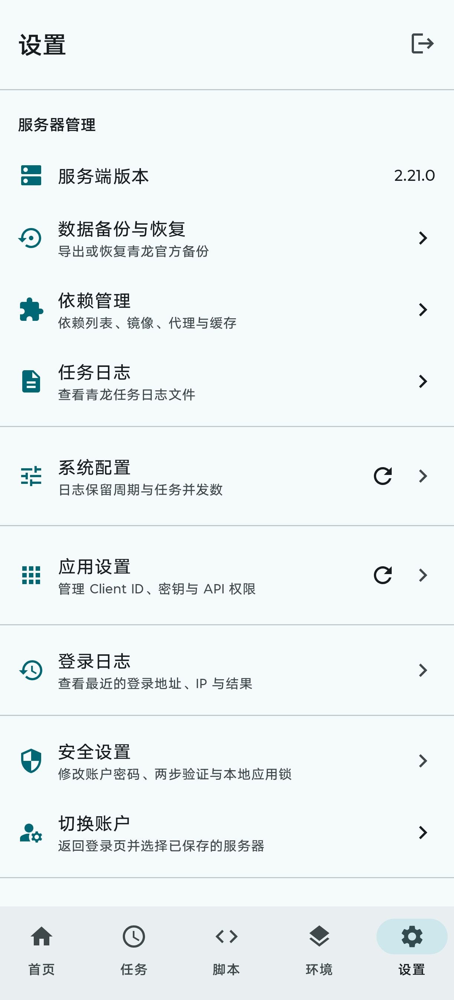

<p align="center">
  
</p>

<h1 align="center">AzureQL</h1>

<p align="center"><strong>Azure Dragon Panel</strong><br>面向青龙面板的原生 Android 管理客户端</p>

<p align="center">
  
  
  <a href="LICENSE"></a>
</p>

<p align="center">
  <a href="https://github.com/Infinifar/AzureQL/releases">下载 APK</a> ·
  <a href="https://github.com/Infinifar/AzureQL/issues">反馈问题</a> ·
  <a href="https://github.com/whyour/qinglong">青龙面板</a>
</p>

## 应用展示

<table>
  <tr>
    <td align="center"><strong>首页仪表盘</strong><br></td>
    <td align="center"><strong>定时任务</strong><br></td>
    <td align="center"><strong>脚本管理</strong><br></td>
  </tr>
</table>

<details>
<summary>更多截图</summary>

<table>
  <tr>
    <td align="center"><strong>环境变量</strong><br></td>
    <td align="center"><strong>订阅管理</strong><br></td>
    <td align="center"><strong>设置</strong><br></td>
  </tr>
</table>

</details>

## 主要功能

| 功能 | 说明 |
| --- | --- |
| 面板管理 | 仪表盘、定时任务、环境变量、订阅、依赖与实时日志。 |
| 脚本编辑 | 内置代码编辑器、语法高亮、批量导入、大文件分段预览与草稿恢复。 |
| 多账户与服务器 | 保存、编辑和切换账户，支持密码与 Client ID 登录。 |
| 安全登录 | 两步验证、mTLS 客户端证书、私有 CA 与加密凭据存储。 |
| 备份与恢复 | 支持本机存储、WebDAV 和 S3 兼容存储。 |
| 通知与系统日志 | 配置并测试青龙通知渠道，按日期查看系统日志。 |
| MCP 集成 | 为 Agent 提供只读查询与受控操作，支持独立授权和本地脱敏审计。 |
| 界面体验 | Material You 动态配色、浅色 / 深色主题、滑动导航与缓存优先加载。 |

## 开始使用

**系统要求：Android 12（API 31）及以上。** 已适配青龙 2.22.0，需要可访问的青龙面板服务端。

1. 从 [GitHub Releases](https://github.com/Infinifar/AzureQL/releases) 下载并安装 APK。
2. 输入面板地址与登录信息；如需 mTLS，先导入 `.p12` / `.pfx` 客户端证书，可选配置私有 CA。
3. 按提示完成两步验证（如已启用）。登录后即可管理面板，多账户、通知与备份可在 **设置** 中配置。

> **MCP 安全提示**：服务默认仅监听本机；局域网模式使用明文 HTTP，仅适用于可信网络，请勿暴露到公网。写入与执行权限需按 Agent 单独授权。接入方式见 [MCP 文档](docs/AZUREQL_MCP_ARCHITECTURE.md)。

## 开发

<details>
<summary>源码构建与技术文档</summary>

使用 Kotlin、Jetpack Compose 与 Material 3 构建。可用 Android Studio 打开项目；配置好 Android 构建环境后，也可执行：

```bash
git clone https://github.com/Infinifar/AzureQL.git
cd AzureQL
./gradlew :app:assembleDebug
```

**MCP**：[架构与接入](docs/AZUREQL_MCP_ARCHITECTURE.md) · [安全模型](docs/AZUREQL_MCP_SECURITY.md) · [工具契约](docs/AZUREQL_MCP_TOOL_SPEC.md) · [兼容说明](docs/MCP_COMPATIBILITY.md)

**工程文档**：[性能测试](benchmark/README.md) · [改进计划](docs/IMPROVEMENT_PLAN.md) · [日常构建](docs/GITLAB_CI.md)

</details>

## 许可证

AzureQL 使用 [MIT License](LICENSE)。Sora Editor、Monarch 语法定义等第三方组件适用各自许可证，详见 [第三方组件声明](THIRD_PARTY_NOTICES.md)。
